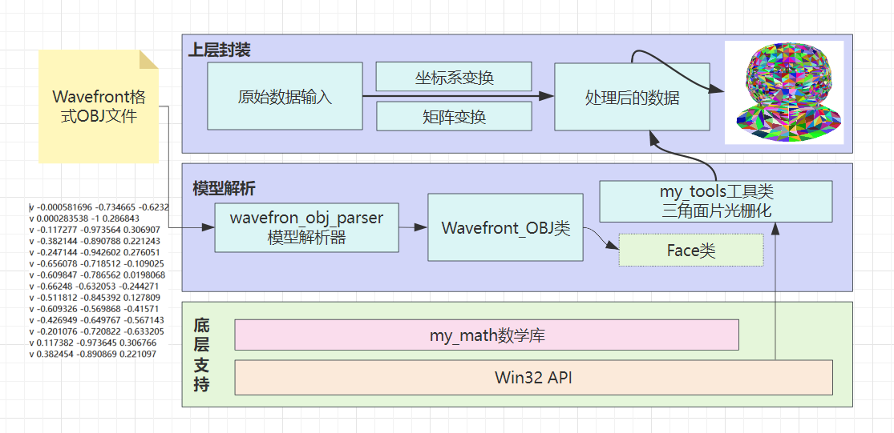
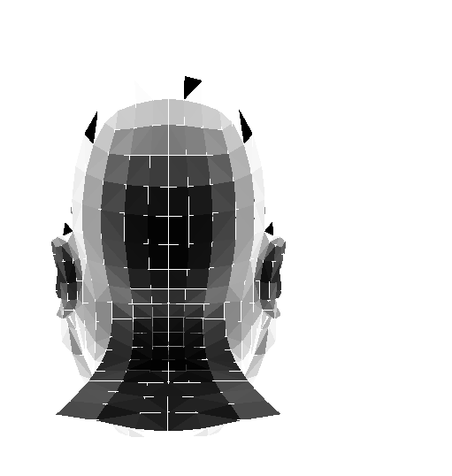

# 项目框架



# 渲染器逻辑





## 一、创建窗口

 	1. 开发环境：Visual Studio 2022
 	2. 桌面环境：Windows10
 	3. 项目类型：Windows桌面向导，确保选择桌面应用程序，附加选项勾选空项目
 	4. 代码参考：[此处代码创建一个窗口](https://github.com/xxx-x-x/Renderer/blob/main/Task2-%E7%BC%96%E5%86%99Win%E7%AA%97%E5%8F%A3/main.cpp)

## 二、数学库的编写

> （x，y，z）既可以表示向量，也可以表示点，引入齐次坐标进行区分。
>
> （x，y，z，w）的w表示齐次坐标，当w=1时，表示为点，当w=0时，表示为向量

### 2.1 二维向量


### 2.2 三维向量

### 2.3 自定义阶数的矩阵

​	我们通过MVP 乘以 模型坐标，一直在改变模型位置

模型坐标应该一直被改变，所以不能被反复重置，应该保存到全局变量中

## 三、工具类的编写

## 四、编写模型类

## 五、双缓冲算法

​	当不使用任何缓冲算法时，绘制函数将直接在**`显示设备上下文`**上进行绘制。在慢放过程中，可以明显观测到绘制过程。当片元发生移动、旋转、缩放时，可以明显观测到锯齿边缘的抖动。

​	当使用双缓冲算法时，绘制函数将在**`内存设备上下文`**中进行绘制，绘制完成后**整体**拷贝到**`显示设备上下文`**中。在慢放过程中，可以明显观测到一次性绘制完成。当片元发生移动、旋转、缩放时，并不能明显观测到锯齿。

### 5.1 内存设备上下文

​	若要使应用程序能够将输出置于内存中，而不是将其发送到实际设备，请使用特殊的设备上下文进行位图操作，称为 **`内存设备上下文`**。 内存 DC 使系统能够将部分内存视为虚拟设备。 它是内存中的一个位数组，应用程序可以暂时使用该数组来存储在普通绘图图面上创建的位图的颜色数据。 由于位图与设备兼容，因此内存 DC 有时也称为**`兼容的设备上下文`**。

### 5.2 位图

​	内存 DC 存储特定设备的位图图像。 应用程序可以通过调用 [**CreateCompatibleDC**](https://learn.microsoft.com/zh-cn/windows/desktop/api/Wingdi/nf-wingdi-createcompatibledc) 函数来创建内存 DC。

​	内存 DC 中的原始位图只是占位符。 其尺寸是一个像素乘以一个像素。 应用程序必须通过调用 [**SelectObject**](https://learn.microsoft.com/zh-cn/windows/desktop/api/Wingdi/nf-wingdi-selectobject) 函数来选择具有适当宽度和高度的位图，然后应用程序才能开始绘制 DC。 若要创建相应维度的位图，请使用 [**CreateBitmap**](https://learn.microsoft.com/zh-cn/windows/desktop/api/Wingdi/nf-wingdi-createbitmap) 函数。 将位图选入内存 DC 后，系统会将单位数组替换为足够大的数组，以存储指定像素矩形的颜色信息。

​	当应用程序将 [**CreateCompatibleDC**](https://learn.microsoft.com/zh-cn/windows/desktop/api/Wingdi/nf-wingdi-createcompatibledc) 返回的句柄传递给绘图函数之一时，请求的输出不会显示在设备的绘图图面上。 相反，系统会将生成的线条、曲线、文本或区域的颜色信息存储在位数组中。 应用程序可以通过调用 [**BitBlt**](https://learn.microsoft.com/zh-cn/windows/desktop/api/Wingdi/nf-wingdi-bitblt) 函数，将内存 DC 标识为源设备上下文，将窗口或屏幕 DC 标识为目标设备上下文，将存储在内存中的图像复制回绘图图面。

### 5.3 双缓冲原理

​	通过屏幕HWND获取到屏幕DC，然后通过屏幕DC创建兼容的内存DC，我们还需要根据屏幕DC来创建一个内存位图，将内存位图选入内存DC中，然后我们在内存DC中（其实是画在内存位图上的，但是需要使用DC句柄）进行绘制，再将绘制结果拷贝到屏幕DC上，消息循环中，将屏幕DC中的内容绘制出来

## 六、FPS计算显示

​	暂时使用简单的方法进行绘制

### 6.1 计时函数

​	clock() 函数是 C 标准库 `time.h` 中的一个函数, `time.h` 标准库中定义了各种涉及日期和时间的函数, 变量类型和宏. 其中, clock() 函数可以返回自程序开始执行到当前位置为止, 处理器走过的时钟打点数(*即"ticks", 可以理解为"处理器时间"*). 每过千分之一秒(*即 1 毫秒*)则 clock() 函数的返回值加 1. clock() 计算结果为**毫秒**

### 6.2 帧数变量转字符串

​	TextOut函数只能输入**`LPCWSTR`**类型字符串，所以涉及到字符串转换，我们需要从**`int`**类型转化为**`LPCWSTR`**类型。

​	**头文件导入**

~~~c++
include<stdlib.h>
using std::wstring;
~~~

​	**INT -> LPCWSTR**

~~~c++
int value = 123;
wchar_t cha[10];
_itow_s( value, cha, 10, 10);
~~~

​	**LPCWSTR -> INT**

```c++
LPCWSTR wstr = L"abc";
wstring tempstr( wstr);
int value = _wtoi( tempstr.c_str());
```

### 6.3 帧数显示原理

​	在绘制图像开始时，调用**clock()**函数获得程序运行时间，在绘制结束时同样调用**clock ()**来获得程序运行时间，两者做差得到这副画面的渲染时间，帧数表示一秒内渲染器所渲染的画面数量，所以用一秒除以此画面的渲染时间，得到帧率。

#### 参考文献：

1. [GAMES101-现代计算机图形学入门-闫令琪](https://www.bilibili.com/video/BV1X7411F744/?spm_id_from=333.337.search-card.all.click&vd_source=26caf3f7dc50266646d431ae50462531)

2. [计算机图形学系列笔记](https://www.zhihu.com/column/c_1249465121615204352)

3. [演练：创建Windows桌面应用程序](https://learn.microsoft.com/zh-cn/cpp/windows/walkthrough-creating-windows-desktop-applications-cpp?view=msvc-170)

4. [DeleteDC() ReleaseDC()和DeleteObject()之间的区别](https://blog.csdn.net/oyhb_1992/article/details/78794217)

5. [位图，设备上下文和BitBlt](http://winprog.org/tutorial/zh/bitmaps_cn.html)

6. [releaseDC函数](https://learn.microsoft.com/zh-cn/windows/win32/api/winuser/nf-winuser-releasedc)

7. [C++字符串转换，我人给转麻了](https://www.cnblogs.com/kevinWu7/p/10163535.html)

8. [C / C++ 中的计时函数: clock()](https://blog.csdn.net/wy_bk/article/details/89213965)

9. [windows获取高精度时间](https://blog.csdn.net/weixin_40311850/article/details/105556058)

10. [C++全局变量定义在哪里合适](https://blog.csdn.net/weixin_43360707/article/details/108796577)

11. [obj格式解析](https://blog.csdn.net/zb1165048017/article/details/109103791)

12. [.obj文件格式与.mtl文件格式](https://blog.csdn.net/u013467442/article/details/46792495)

13. [Make命令教程](https://www.ruanyifeng.com/blog/2015/02/make.html)

14. [Make删除文件](https://blog.csdn.net/qq_25100723/article/details/122901686)

15. [win32静态链接库](https://stackoverflow.com/questions/8664792/undefined-reference-to-textouta20)

16. [vscode控制台乱码](https://juejin.cn/post/7032129567473188872)

# API文档


