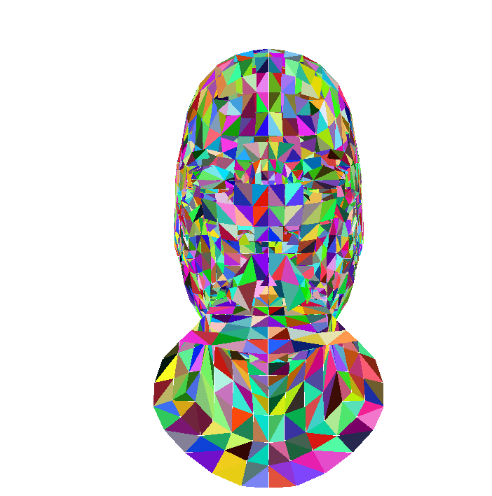

# CPU软光栅化渲染器

## way1：源码编译

~~~sh
# windows10,vscode,MinGW-w64
git clone https://github.com/xxx-x-x/Renderer.git 
cd 完整项目代码/Renderer(vc)
make
./main.exe
~~~

## way2：Visual Studio运行

~~~ sh
# windows10，vs2022
git clone https://github.com/xxx-x-x/Renderer.git 
cd 完整项目代码/Renderer
./Renderer.sln
~~~

# 项目框架


# 渲染图

|  |  |
| ------------------------------------------------------------ | ------------------------------------------------------------ |

# 渲染逻辑

## 一、创建窗口

方法有二：

​	第一种是直接使用visual studio 2022 的windows 桌面向导，确保选择桌面应用程序，附加选项勾选空项目，[此处代码创建一个窗口](https://github.com/xxx-x-x/Renderer/blob/main/Task2-%E7%BC%96%E5%86%99Win%E7%AA%97%E5%8F%A3/main.cpp)，粘贴后运行即可。

​	第二种使用vscode编写，通过命令行编译，同样使用[代码](https://github.com/xxx-x-x/Renderer/blob/main/Task2-%E7%BC%96%E5%86%99Win%E7%AA%97%E5%8F%A3/main.cpp)，命令行编译需要在末尾手动加动态链接库`-lgdi32`

## 二、数学库的编写

​	所有与数学运算相关的逻辑放在这里，数学库是计算机图形学的底层支持，坐标变换、光栅化、背面剔除和消隐等等都需要数学运算，数学库出错将直接导致后期渲染错误。

​	数学库应该包括三个类：二维向量，三维向量，四阶矩阵。顺带一提，向量应该包含一个齐次坐标，每个点的真实坐标都应该是除以齐次坐标后得到的坐标。同时，齐次坐标另一个作用是标志点和向量。点坐标为1，点减去点得到的向量为0，向量加点得到的坐标为1，点加点得到的2（除以齐次坐标后，表示为两点中点）

​	三维向量和二维向量都应该提供默认构造函数、拷贝构造函数、虚析构函数、不含齐次坐标的构造函数和含有齐次坐标的构造函数。都应该有置取函数、单位化向量、求模、归一化、输出向量等等。都应该重载加减乘除等运算（包括叉乘）。

​	矩阵类需要较为复杂，有多种构造形式，有Model变换矩阵，有View视角变换矩阵，有Projection投影矩阵，都应该实现不同的参数构造不同的矩阵。都应该实现矩阵与向量之间的运算，矩阵与矩阵的运算等等。

​	还应该包括一起其他可能用到的数学函数，包括判断三者是否相等、最大最小值、求重心坐标等等。

​	**数学库是图形学中最基础，也是最重要的底层支持库，数学库出错将导致严重后果**

## 三、工具文件的编写

工具文件是存放所有渲染工具的文件，本渲染器的工具文件中有六个函数：

1. 根据x，y值**画点**
2. 根据二维向量**画点**
3. 使用DDA算法**画线**
4. 使用Bresenham算法**画线**
5. 使用扫描线算法**光栅化**
6. 使用重心坐标和AABB包围盒**光栅化**

## 五、编写模型类

​	**为什么要编写模型类？**因为我们需要一个数据结构来保存我们模型解析器解析出来的模型数据。我们使用的模型为WaveFront公司推出的OBJ模型文件，最基本的结构如下：

>v 几何体顶点 (Geometric vertices) 
>
>vt 贴图坐标点 (Texture vertices) 
>
>vn 顶点法线 (Vertex normals) 
>
>f 面 (Face)

​	我的模型解析器解析完成后需要一个数据结构进行存储，我声明为wavefron_obj模型类。按照wavefront协议的标准格式，obj模型类应该包括以下成员：

	1. 一个char数组，用来存放**mtl材质文件**的路径
	1. 一个Vector3类型的数组v，用来存放所有几何体顶点坐标，即v中的数据
	1. 一个Vector3类型的数组vt，用来存放所有贴图坐标，即vt中的数据
	1. 一个Vector3类型的数组vn，用来存放所有顶点法线，即vn中的数据
	1. 一个**Face**类的数组f，用来存放所有的面，即f中的数据

​	值得一提的是，我还没有实现**Face**类。观察wavefront协议的obj格式:**f v1/vt1/vn1 v2/vt2/vn2 v3/vt3/vn3**，我们的**Face面**应该包括三组顶点信息，每组的第一个数据为顶点坐标**索引**，第二个数据为贴图坐标**索引**，第三个数据为法线坐标**索引**，注意都是索引，而非坐标点，我们**通过Face中的v1索引，到obj的v顶点数组中找点**，希望你明白我在说什么，如果不清楚，可以查看最下方的参考文献。如上所述，我们的**Face类**，应该包括三个数组：

	1. 数组vertex_index，用来存放三组顶点信息中的第一个索引值，顶点坐标索引v1，v2，v3
	1. 数组vertex_texture_index，用来存放三组数据顶点信息中的第二个索引值，贴图坐标索引：vt1，vt2，vt3
	1. 数组vertex_normal_index，用来存放三组数据顶点信息中的第三个索引值，法线坐标索引：vn1，vn2，vn3

这样，Face面类使用三个数组，存放了所有顶点信息。当我们数组下标为0时，三个数组的值为第一组顶点信息的。当我们数组下标为1时，三个数组的值为第二组顶点信息的，希望你明白我在说什么。

​	回到模型类，至此，我们模型类的结构就完整了。**但是我们应该思考一个问题，我们的模型解析器应该写在什么位置？**我有两个想法：

1. 单独写一个模型解析器，模型解析器需要传入模型的URL统一资源定位符，我们的返回值为模型类，使用模型类对象接收解析器的返回值。
2. 写在模型类的构造函数中，构造函数需要传入一个URL资源定位符，直接解析到实例化的对象上。

## 六、双缓冲算法

​	当不使用任何缓冲算法时，绘制函数将直接在**`显示设备上下文`**上进行绘制。在慢放过程中，可以明显观测到绘制过程。当片元发生移动、旋转、缩放时，可以明显观测到锯齿边缘的抖动。

​	当使用双缓冲算法时，绘制函数将在**`内存设备上下文`**中进行绘制，绘制完成后**整体**拷贝到**`显示设备上下文`**中。在慢放过程中，可以明显观测到一次性绘制完成。当片元发生移动、旋转、缩放时，并不能明显观测到锯齿。

​	若要使应用程序能够将输出置于内存中，而不是将其发送到实际设备，请使用特殊的设备上下文进行位图操作，称为 **`内存设备上下文`**。 内存 DC 使系统能够将部分内存视为虚拟设备。 它是内存中的一个位数组，应用程序可以暂时使用该数组来存储在普通绘图图面上创建的位图的颜色数据。 由于位图与设备兼容，因此内存 DC 有时也称为**`兼容的设备上下文`**。

​	内存 DC 存储特定设备的位图图像。 应用程序可以通过调用 [**CreateCompatibleDC**](https://learn.microsoft.com/zh-cn/windows/desktop/api/Wingdi/nf-wingdi-createcompatibledc) 函数来创建内存 DC。

​	内存 DC 中的原始位图只是占位符。 其尺寸是一个像素乘以一个像素。 应用程序必须通过调用 [**SelectObject**](https://learn.microsoft.com/zh-cn/windows/desktop/api/Wingdi/nf-wingdi-selectobject) 函数来选择具有适当宽度和高度的位图，然后应用程序才能开始绘制 DC。 若要创建相应维度的位图，请使用 [**CreateBitmap**](https://learn.microsoft.com/zh-cn/windows/desktop/api/Wingdi/nf-wingdi-createbitmap) 函数。 将位图选入内存 DC 后，系统会将单位数组替换为足够大的数组，以存储指定像素矩形的颜色信息。

​	当应用程序将 [**CreateCompatibleDC**](https://learn.microsoft.com/zh-cn/windows/desktop/api/Wingdi/nf-wingdi-createcompatibledc) 返回的句柄传递给绘图函数之一时，请求的输出不会显示在设备的绘图图面上。 相反，系统会将生成的线条、曲线、文本或区域的颜色信息存储在位数组中。 应用程序可以通过调用 [**BitBlt**](https://learn.microsoft.com/zh-cn/windows/desktop/api/Wingdi/nf-wingdi-bitblt) 函数，将内存 DC 标识为源设备上下文，将窗口或屏幕 DC 标识为目标设备上下文，将存储在内存中的图像复制回绘图图面。

​	**最后，强调一下双缓冲的原理**：

​	通过屏幕HWND获取到屏幕DC，然后通过屏幕DC创建兼容的内存DC，我们还需要根据屏幕DC来创建一个内存位图，将内存位图选入内存DC中，然后我们在内存DC中（其实是画在内存位图上的，但是需要使用DC句柄）进行绘制，再将绘制结果拷贝到屏幕DC上，消息循环中，将屏幕DC中的内容绘制出来。

## 七、FPS计算显示

​	暂时使用简单的方法进行绘制

​	clock() 函数是 C 标准库 `time.h` 中的一个函数, `time.h` 标准库中定义了各种涉及日期和时间的函数, 变量类型和宏. 其中, clock() 函数可以返回自程序开始执行到当前位置为止, 处理器走过的时钟打点数(*即"ticks", 可以理解为"处理器时间"*). 每过千分之一秒(*即 1 毫秒*)则 clock() 函数的返回值加 1. clock() 计算结果为**毫秒**。

​	TextOut函数只能输入**`LPCWSTR`**类型字符串，所以涉及到字符串转换，我们需要从**`int`**类型转化为**`LPCWSTR`**类型。

​	**头文件导入**

~~~c++
include<stdlib.h>
using std::wstring;
~~~

​	**INT -> LPCWSTR**

~~~c++
int value = 123;
wchar_t cha[10];
_itow_s( value, cha, 10, 10);
~~~

​	**LPCWSTR -> INT**

```c++
LPCWSTR wstr = L"abc";
wstring tempstr( wstr);
int value = _wtoi( tempstr.c_str());
```

​	**帧数显示原理如下：**

​	在绘制图像开始时，调用**clock()**函数获得程序运行时间，在绘制结束时同样调用**clock ()**来获得程序运行时间，两者做差得到这副画面的渲染时间，帧数表示一秒内渲染器所渲染的画面数量，所以用一秒除以此画面的渲染时间，得到帧率。

## 八、手搓模型解析器

模型解析器思路如下：

​	我们创建一个wavefron_obj类对象（后简称obj类），用来存放解析后的数据。我们使用文件流操作来打开obj模型文件，并检查打开是否成功。创建一个buffer缓冲区，我们使用行读取来读取文件，读取到的行数据，存放在buffer缓冲区中，我们在循环中处理行数据，如果能获取到行，我们进行循环，若获取不到，说明文件读取结束，停止循环。在循环处理中，我们根据每一行中，不同的**首字符**进行不同的处理，如**f**表示面，进行面处理，**v**表示点，进行点处理。

​	如果首字符是**#**，说明是注释，不处理，跳过循环

​	如果首字符是**v**，并且第二个字符是**空格**，说明是点，我们使用**strtod**逐个读取数据，存入Vector3中，并且将Vector3**放入到obj模型的v数组中**即可。

​	如果首字符是**v**，并且第二个字符是**t**，同上，不过我们**放入到obj模型的vt数组中**。

​	如果首字符是**v**，并且第二个字符是**n**，**放入到obj模型的vn数组中**。

​	如果首字符是**f**，并且第二个字符是**空格**，说明是面，我们使用**strtok**，使用**空格**对**三组数据**进行分割。对每组数据进行单独处理。

​	此处需要详细描述，暂定。

## 九、编写makefile文件

​	为什么使用makefile，因为文件实在是太多了，还记得之前说的，使用vscode时，每次编译的时候都需要手动加上动态链接库**-lgdi32**，使用makefile之后，每次编译都只需要make一下即可。

~~~makefile
main: main.o my_tools.o my_math.o face.o wavefront_obj.o wavefront_obj_parser.o 
	g++ -o main main.o my_tools.o my_math.o face.o wavefront_obj.o wavefront_obj_parser.o -lgdi32
	del *.o
parse: face.o wavefront_obj.o wavefront_obj_parser.o my_math.o 
	g++ -o parse ./obj_parser/test.cpp face.o wavefront_obj.o wavefront_obj_parser.o my_math.o
	del *.o
main.o:
	g++ -o main.o -c ./main.cpp 
my_tools.o:
	g++ -o my_tools.o -c ./my_tools/my_tools.cpp

my_math.o:
	g++ -o my_math.o -c ./my_math/my_math.cpp
face.o:
	g++ -o face.o -c ./my_models/face.cpp
wavefront_obj.o:
	g++ -o wavefront_obj.o -c ./my_models/wavefront_obj.cpp
wavefront_obj_parser.o:
	g++ -o wavefront_obj_parser.o -c ./obj_parser/wavefront_obj_parser.cpp
~~~


## 十、背面剔除

​	首先我们应该知道如何区分模型的正面和背面，答案是模型的制作时，会规定好顶点的顺序，使得模型的每一个面的法向量朝向模型外部。假设坐标系Z轴向**左**时，正面法向量的Z轴时正值，背面是负值。法向量示意图：

图中圆形表示一个球，黄色箭头表示光照方向。因为我们规定了三角面的点的顺序，使得模型所有面的法向量都朝外，这时我们可以观察到在蓝色虚线左边是面向光的一侧，法向量与光照负方向夹角小于90°，被照亮；而虚线右边是背光的一侧，法向量与光照负方向夹角大于90°，处于黑暗中。

​	现在细化到一个三角面片，我们如何求它的面法向量呢


需要注意的是，我们**不能使用MVP**变换后的坐标点来计算法线，因为X，Y被变换了，但是Z轴没有被变换，使用**屏幕坐标系**的模型点计算法线是错误的，不正确的，应当使用**世界坐标系**下的点计算法线，或者说应当使用**原始模型坐标**。

这个时候让我们来分析分析光影是怎么表现出物体的表面凹凸的。**我们自己定义一个光照方向**，通常是放在（0，0，0），看向（0，0，-1）点。这个方向是放在**世界坐标系**下的。


​	上图中，黄色的线表示光照，黑色的线表示物体表面。可以看出相同的光照对于不同角度的物体表面会有不同的照射面积，θ越大（光照与法线的夹角），相同的光通量会照射在更大的物体表面上，由能量守恒可知对应的光照强度会越小。也就是说，当我们假设光源是一束理想的平行光，这时模型法线方向与光照方向的夹角越小，能量越集中，表面会越亮！所以我们可以用 **光照方向\*法线方向\*cosθ** 来表示光照强度。-1时，光照强度最大，0时，光照强度最小，注意，θ大于90°时，会出现正值，这个时候我们可以舍弃掉这些负值。**如果觉得负值标识光照强度不舒服，也可以使用光照的负方向来与法线点乘**。

## 十一、消隐算法

​	**像素点的z轴怎么算？**我们知道要被光栅化的三角面片的三个顶点坐标，其中的每个像素点，都可以使用三个顶点坐标的重心坐标表示，所以像素点的z值，就是三个顶点坐标的z值乘以对应的重心坐标权重。

​	这里有一个问题，**能否使用屏幕坐标系下的坐标点，或者说，最终变换后的点**，答案是可以的，因为**相似三角形**，我们的z值也是等比例缩小的。但是法线不行，**想象一下，放大XY，不放大Z，面被拉长了，法线歪麻了**。

让我们先定义zbuffer，因为是逐像素存储距离，所以需要创建一个width*height大小的数组，然后初始化给一些很小的值（我比较笨，给了负一万），需要修改光栅化函数，将zbuffer传入。在光栅化时，判断一下我们要绘制的这个坐标的z轴，是否大于zbuffer中的z轴，如果大于，说明这个坐标点在上层，应该被绘制出来，同时更新zbuffer，如果小于zbuffer中的值，那说明我们这个坐标点在下层，不应该被渲染出来。

#### 参考文献：

1. [GAMES101-现代计算机图形学入门-闫令琪](https://www.bilibili.com/video/BV1X7411F744/?spm_id_from=333.337.search-card.all.click&vd_source=26caf3f7dc50266646d431ae50462531)

2. [计算机图形学系列笔记](https://www.zhihu.com/column/c_1249465121615204352)

3. [演练：创建Windows桌面应用程序](https://learn.microsoft.com/zh-cn/cpp/windows/walkthrough-creating-windows-desktop-applications-cpp?view=msvc-170)

4. [DeleteDC() ReleaseDC()和DeleteObject()之间的区别](https://blog.csdn.net/oyhb_1992/article/details/78794217)

5. [位图，设备上下文和BitBlt](http://winprog.org/tutorial/zh/bitmaps_cn.html)

6. [releaseDC函数](https://learn.microsoft.com/zh-cn/windows/win32/api/winuser/nf-winuser-releasedc)

7. [C++字符串转换，我人给转麻了](https://www.cnblogs.com/kevinWu7/p/10163535.html)

8. [C / C++ 中的计时函数: clock()](https://blog.csdn.net/wy_bk/article/details/89213965)

9. [windows获取高精度时间](https://blog.csdn.net/weixin_40311850/article/details/105556058)

10. [C++全局变量定义在哪里合适](https://blog.csdn.net/weixin_43360707/article/details/108796577)

11. [obj格式解析](https://blog.csdn.net/zb1165048017/article/details/109103791)

12. [.obj文件格式与.mtl文件格式](https://blog.csdn.net/u013467442/article/details/46792495)

13. [Make命令教程](https://www.ruanyifeng.com/blog/2015/02/make.html)

14. [Make删除文件](https://blog.csdn.net/qq_25100723/article/details/122901686)

15. [win32静态链接库](https://stackoverflow.com/questions/8664792/undefined-reference-to-textouta20)

16. [vscode控制台乱码](https://juejin.cn/post/7032129567473188872)

17. [从零构建光栅器，tinyrenderer笔记（上)](https://zhuanlan.zhihu.com/p/399056546)

# API文档


